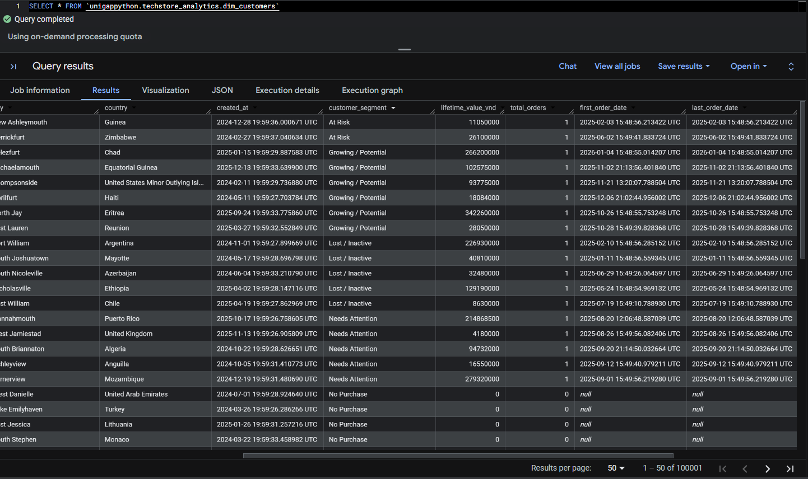

# 🏗️ Building an End-to-end Retail Data Pipeline for Techstore Vietnam | Python / SQL / Power BI
### End-to-End ETL Pipeline | Python · Google Cloud Storage · BigQuery · Power BI | Star Schema Data Warehouse


---

## 📑 Table of Contents

1. [📌 Background & Overview](#-background--overview)
2. [📂 Data Sources](#-data-sources)
3. [🏛️ Architecture & Design](#-architecture--design)
4. [⚒️ Main Process](#-main-process)
5. [🗄️ Data Model (Star Schema)](#-data-model-star-schema)
6. [📊 Results - BigQuery Output](#-results--bigquery-output)
7. [📈 Power BI Demo](#-power-bi-demo)
8. [🗂️ Project Structure](#-project-structure)
9. [🔎 Conclusion & Business Impact](#-conclusion--business-impact)
10. [⚙️ Setup Instructions](#-setup-instructions)

---

## 📌 Background & Overview

### Business Context

**TechStore Vietnam** is a technology retail company that sells across multiple channels - an online Shopify store, Sapo POS at physical locations, and other online order platforms. Customers pay through MoMo, ZaloPay, PayPal, and Mercury Bank.

Before this project, data from each channel lived in a separate system. There was no single place to see the full picture - how much was sold, whether payments were collected, or how customers behaved across channels.

### What This Project Does

This project builds a **Python ETL pipeline** that pulls data from all sources, cleans and standardises it, and loads it into a **Google BigQuery data warehouse** - so every team works from the same data.

✔️ Connects **8 data sources** (3 sales channels + 4 payment sources + cart tracking) into one place.

✔️ Organises data into a **Star Schema** with 4 active dimension tables and 5 fact tables, ready for analysis.

✔️ Runs **automatic data quality checks** at every step - catching nulls, duplicates, bad dates, and outliers before anything gets loaded.

✔️ After each run, automatically re-calculates **customer RFM segments** and lifetime value using a BigQuery SQL query.

✔️ Creates **3 ready-to-use views** for common business questions: customer journey, daily cashflow, and payment status.

### Who Is This Project For?

✔️ Data engineers looking at pipeline design patterns with GCP

✔️ Analytics engineers who want to see how multi-source ETL is structured in Python

✔️ Business teams who need a reliable, unified view of sales, payments, and customer behaviour

---

## 📂 Data Sources

All raw data is stored in **Google Cloud Storage (GCS)** as `.json.gz` files, one folder per source. The pipeline reads from GCS directly - no extra staging step needed.

| Source | Folder | Data Volume | Format |
|---|---|---|---|
| Shopify (Online Store) | `shopify/` | 2M customers · 200K orders · 1K products | `.json.gz` |
| Sapo POS (Offline Stores) | `sapo/` | 1M orders · 50 store locations | `.json.gz` |
| Online Orders (Multi-channel) | `online_orders/` | 50K orders | `.json.gz` |
| PayPal | `paypal/` | 300 transactions | `.json.gz` |
| MoMo | `momo/` | 500 transactions | `.json.gz` |
| ZaloPay | `zalopay/` | 500 transactions | `.json.gz` |
| Mercury Bank | `mercury/` | 3 accounts · 500 transactions | `.json.gz` |
| Cart Tracking | `cart_tracking/` | 10,000+ events | `.json.gz` |

### Sample Raw Data Schemas

Each source has its own data format. Below are three examples:

**Shopify Orders**
```json
{
  "id": "int",
  "transaction_id": "string",
  "customer_id": "int",
  "order_date": "datetime",
  "payment_status": "string",
  "total_vnd": "int",
  "total_usd": "float",
  "line_items": "array",
  "source": "shopify"
}
```

**Sapo POS Orders**
```json
{
  "id": "int",
  "code": "string",
  "transaction_id": "string",
  "customer": "object",
  "line_items": "array",
  "total_vnd": "int",
  "status": "string",
  "source": "sapo_pos"
}
```

**Cart Tracking Events**
```json
{
  "event_id": "string",
  "event_type": "string",
  "session_id": "string",
  "customer_id": "int",
  "product_id": "int",
  "timestamp": "datetime",
  "utm_source": "string",
  "utm_campaign": "string"
}
```

> For full column details on all tables, see the 📄 [Data Dictionary](data_dictionary.md).

---

## 🏛️ Architecture & Design

### Pipeline Architecture


*Figure 1: End-to-End Pipeline - GCS → ETL Engine → BigQuery → Power BI*

| Step | What Happens |
|---|---|
| **1. Extract** | The pipeline connects to GCS using a Storage service account and reads all `.json.gz` files. |
| **2. Transform** | Data is cleaned and reshaped in memory using Python and Pandas. |
| **3. Load** | Cleaned tables are written to BigQuery using a separate BigQuery service account. |
| **4. Visualise** | Power BI connects directly to BigQuery to display dashboards. |

---

## ⚒️ Main Process

### Step 1: Extract - Reading files from GCS

Each data source has its own extractor class that knows where its files live. All extractors share the same base logic (connect to GCS, list files, unzip and read `.json.gz`) through a `BaseExtractor` class - so there's no repeated code.

`PaymentExtractor` handles all four payment sources in one class. Mercury Bank is a special case - it returns two separate tables (`accounts` and `transactions`), while the other three return a single flat table each.

### Step 2: Transform - Cleaning and Shaping Data

All common transformation logic lives in `BaseTransformer`, which both `DimTransformer` and `FactTransformer` inherit from. This includes:

- **`to_date()`** - turns text date columns into proper datetime format; bad values become null instead of errors
- **`convert_ns_to_us()`** - converts timestamp precision so BigQuery can accept it without errors
- **`create_date_key()`** - creates an integer date key like `20240315` for linking to the date dimension
- **`create_surrogate_key()`** - builds a unique ID by combining multiple columns (e.g. `shopify_ORDER123_TXN456`)
- **`unflatten_list()`** - expands nested product arrays inside orders into individual rows
- **`data_quality_check()`** - checks for nulls, flags duplicate rows with `is_deleted = 1`, validates date ranges, and detects amount outliers using IQR
- **`handle_missing_value()`** - fills specific null columns with safe defaults (e.g. guest `customer_id` → `-1`)

**Dimension tables** built by `DimTransformer`:

- `dim_customer` - customer profile from Shopify; `customer_segment`, `first_order_date`, `last_order_date` start empty and get filled in later by the SQL step
- `dim_product` - product catalogue from Shopify; `is_active` flag added
- `dim_location` - store locations from Sapo POS; `location_type` set to `Offline Store`

**Fact tables** built by `FactTransformer`:

- `fact_orders` - combines orders from Shopify, Online Orders, and Sapo POS. Each source is cleaned separately, then all three are stacked together using `pd.concat`
- `fact_order_items` - explodes the `line_items` array inside each order into individual product rows, then stacks all channels together
- `fact_payments` - standardises payment records from ZaloPay, MoMo, and PayPal. Each gateway uses a different success code - `return_code == 1` for ZaloPay, `resultCode == 0` for MoMo - both are mapped to `SUCCESS`/`FAILED`. **PayPal data was excluded from the final load due to very low data volume**, but the transformer is kept for future use.
- `fact_cart_events` - maps raw user behaviour events (add to cart, view item, etc.) with UTM tracking fields
- `fact_bank_transactions` - processes Mercury Bank records; negative amounts (outflows) are allowed and noted

### Step 3: Load - Writing to BigQuery

`BigQueryLoader` handles all writes to BigQuery. It automatically picks the right partition type based on the column:

- Date/timestamp columns → partition by day
- Integer date key columns (like `20240315`) → range partition

Each table is also **clustered** to make queries faster (e.g. `fact_orders` clusters on `customer_id` and `channel` so filtering by customer or channel is cheap).

All tables use `WRITE_TRUNCATE` - the pipeline does a full reload each run.

### Step 4: SQL Update - Customer Segments (RFM)

After all tables are loaded, the pipeline runs a BigQuery `MERGE` statement that:

1. Pulls order history from `fact_orders` (paid + completed orders only) and calculates each customer's total spend, order count, first order date, and last order date
2. Scores each customer on **Recency, Frequency, and Monetary** value using `NTILE(5)` - giving each axis a score from 1 to 5
3. Combines the three scores into a 3-digit cell (e.g. `555`, `312`) and maps it to a segment name: *At Risk, Growing / Potential, Lost / Inactive, Needs Attention, No Purchase, and others*.
4. Customers with no purchase history are labelled `No Purchase` - their `total_orders = 0` and `first/last_order_date` remain `null`
5. Updates `dim_customer` in place - existing rows are overwritten with the new values 

### Step 5: Orchestration & Error Handling

`PipelineOrchestrator` runs everything in the right order:

```
check_dataset → process_dimensions() → process_facts() → execute_sql_query()
```

Each table has its own `try/except` block - if one source fails (e.g. a bad PayPal file), the rest of the pipeline keeps running. Every step is logged to both the console and a log file via `setup_logger()`.

---

## 🗄️ Data Model (Star Schema)


*Figure 2: Star Schema*

Dimension tables describe the "who", "what", "where", and "when". Fact tables record what actually happened (orders, payments, events) and link back to dimensions via foreign keys.

> For full column-level detail, see the 📄 [Data Dictionary](data_dictionary.md).

### Dimension Tables

| Table | Source | Partition | Key Column | What It Contains |
|---|---|---|---|---|
| `dim_customer` | Shopify | `created_at` | `customer_id` | Customer profile + RFM segment, lifetime value, first/last order date. Updated automatically after each pipeline run. |
| `dim_product` | Shopify | - | `product_id` | Product name, SKU, category, brand, price in VND and USD, stock quantity, active flag. |
| `dim_location` | Sapo POS | - | `location_id` | Store name, code, city, address, phone. `location_type` = `Offline Store`. |
| `dim_date` | - | - | `date_key` | Date attributes: year, quarter, month, week, day name, weekend flag, holiday flag, fiscal period. |

> `dim_staff` was part of the original scope but **not built** - Sapo POS raw data does not include staff information.

### Fact Tables

| Table | Sources | Partition | Cluster | Primary Key | What It Records |
|---|---|---|---|---|---|
| `fact_orders` | Shopify · Online Orders · Sapo POS | `order_date_key` | `customer_id`, `channel` | `order_key` | Every order across all channels. Surrogate key = `channel + order_id + transaction_id`. |
| `fact_order_items` | Shopify · Online Orders · Sapo POS | `order_date_key` | `product_id` | `order_item_key` | Each product line inside an order, exploded from `line_items` arrays. |
| `fact_payments` | ZaloPay · MoMo · PayPal | `payment_date_key` | `customer_id`, `payment_gateway` | `payment_key` | Payment transactions from e-wallet gateways. PayPal excluded in current run due to low data volume. |
| `fact_cart_events` | Cart Tracking | `event_date_key` | `customer_id`, `session_id`, `event_type` | `event_key` | User actions on site: view, add to cart, purchase, etc. Guests use `customer_id = -1`. |
| `fact_bank_transactions` | Mercury Bank | `transaction_date_key` | - | `transaction_key` | Bank-level inflows and outflows. Negative amounts = outflows and are valid. |

### Analytical Views

Three views sit on top of the fact tables and are ready to query directly from Power BI:

| View | Built From | What It Answers |
|---|---|---|
| `vw_customer_journey` | `fact_cart_events` + `fact_orders` | How did each customer move from first interaction to purchase? Shows full event sequence, session info, and `hours_to_first_purchase`. |
| `vw_cashflow_daily` | `fact_orders` + `fact_payments` + `fact_bank_transactions` + `dim_date` | What came in and went out each day? Reconciles sales revenue, payments received, and bank transactions into one daily row with `net_cashflow_vnd`. |
| `vw_payment_status` | `fact_orders` + `fact_payments` | Is each order actually paid? Classifies orders as Paid / Pending  / Partially Paid / Refunded/etc.. , with `payment_delay_hours` and `outstanding_amount_vnd`. |

---

## 📊 Results - BigQuery Output

The screenshots below show real query results from BigQuery after the pipeline has run.

### dim_customer - RFM Segments Auto-Updated



`dim_customer` is updated after every pipeline run via the BigQuery MERGE. The table shows each customer's recalculated `lifetime_value_vnd`, `total_orders`, `last_order_date`, and their current RFM segment - including `No Purchase` for customers with no order history (`total_orders = 0` and `first_order_date` / `last_order_date` left as `null`).

### vw_cashflow_daily - Daily Revenue and Cashflow


`vw_cashflow_daily` brings together sales, payments, and bank records into one row per day. Finance can check whether revenue was actually collected without joining tables manually.

### vw_customer_journey - Touchpoint Sequence Per Customer


`vw_customer_journey` shows each customer's path from first site interaction to purchase - including the full event sequence (e.g. `view_item > add_to_cart > purchase`) and how many hours it took.

### vw_payment_status - Payment Health Per Order


`vw_payment_status` joins orders and payments to classify every order's payment health and flag overdue or partially paid orders.

---

## 📈 Power BI Demo

The three analytical views (`vw_customer_journey`, `vw_cashflow_daily`, `vw_payment_status`) are connected to Power BI via the native BigQuery connector.

### Data Model View in Power BI


*Figure 3: The three views loaded into Power BI's model view.*

### Sample Dashboard (Demo)


*Figure 4: A quick demo dashboard pulling from the three views - charts and cards to verify that data flows through correctly from BigQuery to Power BI. This is not a full analytical dashboard; it is a functional check to confirm the data pipeline end-to-end.*

---

## 🗂️ Project Structure

```
Bach Minh Nam - ETL Pipeline/
├── config/
│   └── config.txt                    # Configuration template
├── 
│   ├── data_dictionary.md            # Full column-level documentation
│   └── Images/                       # Architecture diagrams and screenshots
├── extractors/
│   ├── __init__.py
│   ├── base_extractor.py             # Shared GCS logic: connect, list files, unzip
│   ├── online_extractor.py           # Online orders (multi-channel)
│   ├── payment_extractor.py          # Mercury, MoMo, PayPal, ZaloPay
│   ├── sapo_extractor.py             # Sapo POS offline orders
│   ├── shopify_extractor.py          # Shopify online store
│   └── tracking_extractor.py         # Cart tracking events
├── loaders/
│   ├── __init__.py
│   └── bigquery_loader.py            # Writes to BigQuery with partitioning and clustering
├── orchestration/
│   ├── __init__.py
│   └── pipeline_orchestrator.py      # Runs the full pipeline in order
├── transformers/
│   ├── __init__.py
│   ├── base_transformer.py           # Shared cleaning, key generation, quality checks
│   ├── dimension_transformer.py      # Builds dim_customer, dim_product, dim_location
│   └── fact_transformer.py           # Builds all five fact tables
├── utils/
│   ├── __init__.py
│   ├── config.py                     # Loads environment variables and credential paths
│   └── logger.py                     # Logs to both console and file
├── tests/
│   ├── check_data.py
│   ├── test_extract.py
│   ├── test_load.py
│   └── test_transform.py
├── logs/                             # Pipeline run logs (auto-created)
├── .env.example                      # Example environment config
├── main.py                           # Entry point - run this to start the pipeline
└── requirement.txt                   # Python dependencies
```

---

## 🔎 Conclusion & Business Impact

📍 **Key Outcomes:**

✔️ **One place for all data** - sales from Shopify, Sapo POS, and online channels; payments from MoMo, ZaloPay, PayPal, and Mercury; and user behaviour from cart tracking - all cleaned and in one BigQuery dataset.

✔️ **Faster reporting** - the analytics team gets clean, structured tables they can query directly. No more manual exports or fixing mismatched formats before each report.

✔️ **Daily cashflow visibility** - Finance can check whether money was actually received each day with a single query against `vw_cashflow_daily`.

✔️ **Always up-to-date customer segments** - Marketing gets fresh RFM segments automatically after every pipeline run, without a separate tool or manual step.

✔️ **Easy to extend** - adding a new data source only means writing a new extractor class. Everything else (cleaning logic, loader, orchestrator) stays the same.

---

## ⚙️ Setup Instructions

### What You Need

- Python 3.8 or higher
- A Google Cloud account with BigQuery and Cloud Storage enabled
- A service account with **BigQuery Admin** and **Storage Object Viewer** permissions

### Steps

**1. Clone the repo**
```bash
https://github.com/TascoGitGud/TechStore-Vietnam-End-to-End-Analytics-Pipeline.git
```
**2. Install dependencies**
```bash
pip install -r requirement.txt
```

**3. Set up credentials**

Fill in your GCP credential file paths:

```env
GOOGLE_APPLICATION_CREDENTIALS=path/to/gcs_service_account.json
GOOGLE_APPLICATION_CREDENTIALS_BIGQUERY=path/to/bigquery_service_account.json
```

> GCP credentials are not included in this repo for security reasons.

**4. Set your bucket and dataset**

In `main.py`, update these two lines:
```python
BUCKET_NAME = 'your-gcs-bucket-name'
DATASET_ID = 'your-dataset'
```

**6. Run the pipeline**
```bash
python main.py
```

The pipeline will log every step to the console and to `logs/pipeline.log`. When it finishes, all tables and views will be available in BigQuery under the dataset you configured.
